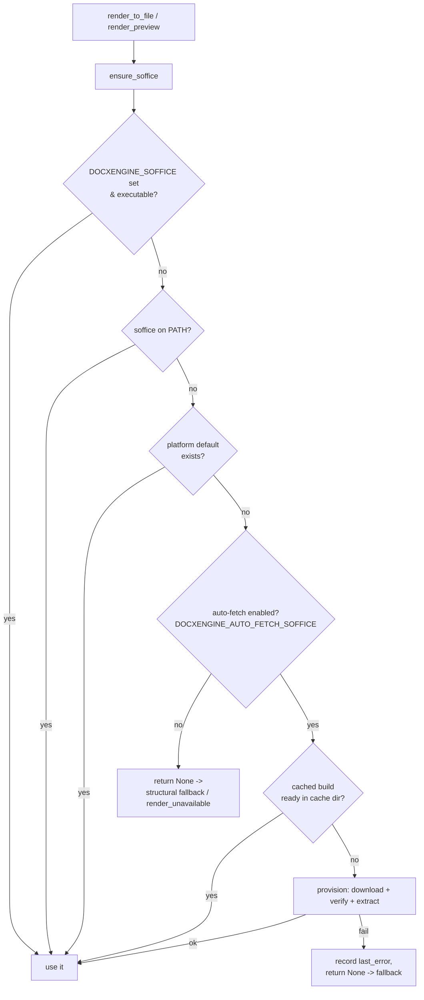

# Architecture: zero-install rendering

## `soffice` resolution order (`_render.ensure_soffice`)

The render entry points call `ensure_soffice()` instead of `detect_soffice()`.
Detection is unchanged and always wins; auto-fetch only runs when nothing local
is found and it is enabled.



## First-render provisioning (the one-time download)

```mermaid
sequenceDiagram
    participant R as _render
    participant S as _soffice
    participant TDF as download.documentfoundation.org
    participant FS as ~/.cache/docxengine

    R->>S: provision_if_enabled()
    S->>S: auto_fetch_enabled()? cached_soffice()?
    S->>TDF: GET stable/ (resolve latest version)
    S->>TDF: GET <artifact>.sha256 (official checksum)
    S->>TDF: GET <artifact> (dmg / deb tarball), streamed
    S->>S: sha256(stream) == expected? (abort if not)
    S->>FS: extract into libreoffice/<version>/
    S->>FS: write .soffice-path marker
    S-->>R: /path/to/soffice
    R->>R: soffice --headless --convert-to pdf ...
    Note over S,FS: subsequent renders hit the cache; no download
```

## Platform artifacts (verified live against TDF, 2026-07-01)

| OS      | Arch          | Artifact                                   | Extraction         |
| ------- | ------------- | ------------------------------------------ | ------------------ |
| macOS   | arm64 / x86_64| `mac/<arch>/LibreOffice_<v>_MacOS_<arch>.dmg` | `hdiutil attach` -> copy `.app` |
| Linux   | x86_64        | `deb/x86_64/LibreOffice_<v>_Linux_x86-64_deb.tar.gz` | untar -> per-`.deb` `ar` + `data.tar.*` |
| other   | -             | none                                       | detection only; actionable error |

Checksum is never hardcoded: the `<artifact>.sha256` sidecar is fetched at
runtime and enforced before anything executes. Version resolves from the TDF
`stable/` listing (override with `DOCXENGINE_SOFFICE_VERSION`).
